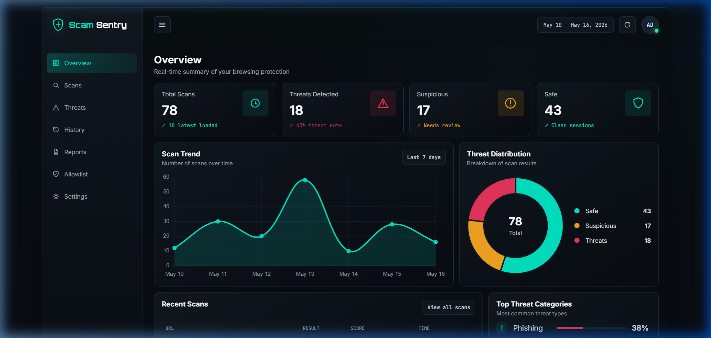
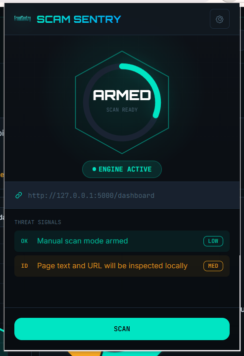
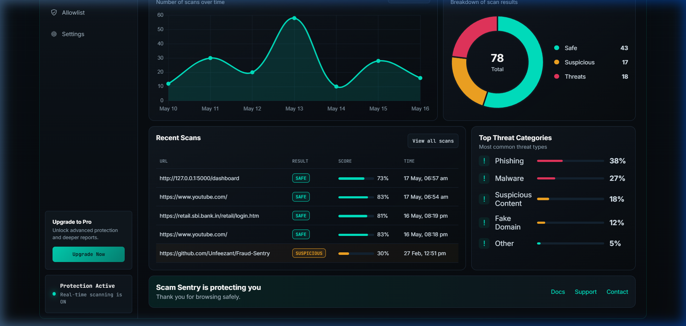
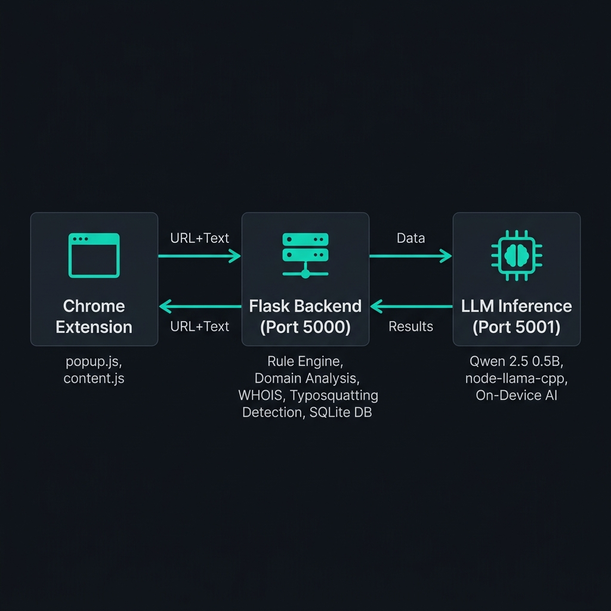

# 🛡️ Scam Sentry

**Stop scams before you pay.**

Scam Sentry is a privacy-first browser extension that detects phishing, scam, and suspicious websites in real-time — all powered by a locally deployed AI model. No cloud APIs. No data leaves your device. Everything runs right on your machine.

<p align="center">
  
</p>

<br/>

## 💡 What is Scam Sentry?

Every day, thousands of people fall victim to online scams — fake payment portals, phishing login pages, and cloned banking websites. Most existing solutions either rely on static blocklists (which miss new threats) or cloud-based AI (which requires sending your browsing data to external servers).

Scam Sentry takes a different approach. It combines **instant rule-based detection** with a **locally running Large Language Model (LLM)** to analyze websites in real-time. The AI model runs entirely on your device using the RunAnywhere SDK, so your browsing data never leaves your machine.

**Here's what makes it different:**

✅ Fully on-device AI inference — no cloud APIs, no OpenAI, no Gemini  
✅ Real-time scanning triggered by a single click  
✅ Two-layer detection: fast rules first, then AI reasoning when needed  
✅ Beautiful analytics dashboard to track your scan history  
✅ Works offline once the model is loaded  
✅ Zero cost — no API keys or subscriptions required  

<br/>

## 📸 Screenshots

### Extension Popup (Armed & Ready)

When you open the Scam Sentry extension, you see the scan-ready state with the current tab's URL displayed. Hit **SCAN** to analyze the page.

<p align="center">
  
</p>

### Dashboard Overview

The dashboard gives you a bird's eye view of all your scan activity — total scans, threats detected, suspicious sites, and safe sessions. The scan trend chart shows your activity over the past week, and the donut chart breaks down the threat distribution at a glance.

<p align="center">
  
</p>

### Recent Scans & Threat Categories

Scroll down to see your most recent scans with URLs, verdicts (Safe, Suspicious, Dangerous), trust scores, and timestamps. The threat categories panel shows the most common threat types the engine has flagged.

<p align="center">
  
</p>

<br/>

## 🏗️ How It Works

Scam Sentry uses a **two-layer detection system** that balances speed with intelligence.

<p align="center">
  
</p>

### Layer 1: Rule-Based Detection (Instant)

The Flask backend performs a battery of fast checks the moment a URL is submitted:

| Check | What it does |
|-------|-------------|
| **Domain Reputation** | Matches against a database of 1 million known legitimate domains |
| **Typosquatting Detection** | Uses Levenshtein distance to catch domains that mimic popular brands (e.g., "go0gle.com") |
| **Risky TLD Analysis** | Flags domains ending in `.xyz`, `.top`, `.site`, `.icu`, `.online` |
| **Structure Analysis** | Detects piracy, illegal streaming, and cracked software patterns in URLs |
| **Domain Age (WHOIS)** | Checks how old the domain is — brand-new domains are riskier |
| **Sensitive Keywords** | Looks for words like "bank", "login", "verify", "account" in suspicious contexts |

If these checks conclusively identify a threat, the user gets an instant result — no AI needed.

### Layer 2: Local LLM Analysis (When Needed)

When rule-based checks are inconclusive, the system escalates to the on-device AI:

1. The page's URL and up to 1,500 characters of visible text are sent to the local inference server
2. A **Qwen 2.5 (0.5B parameter)** model running via `node-llama-cpp` evaluates the content
3. The model reasons about fraud indicators and returns a structured JSON verdict
4. The backend combines the AI score with rule-based signals using a weighted formula

The final trust score is calculated as:

```
Final Score = (0.4 × AI Score) + (0.3 × Structure Score) + (0.2 × Reputation Score) + (0.1 × Age Score)
```

<br/>

## 🤖 The AI Model

| Detail | Value |
|--------|-------|
| Model | Qwen 2.5 Instruct (0.5B parameters) |
| Format | GGUF (Q4_K_M quantization) |
| Runtime | node-llama-cpp (llama.cpp native bindings) |
| Execution | CPU-only, fully local |
| Context Window | 2,048 tokens |

The model is prompted as a cybersecurity ecosystem evaluator. It understands phishing patterns, malware distribution sites, piracy ecosystems, and legitimate web services. It returns structured JSON with a status, trust score, risk category, reasoning, and recommended action.

**This project does NOT use any cloud AI:**

❌ No Google Gemini  
❌ No OpenAI  
❌ No external API calls  

All AI processing happens entirely on your machine.

<br/>

## 📁 Project Structure

```
Scam-Sentry/
└── FraudSentry_new/
    ├── README.md                          ← You are here
    ├── assets/                            ← Screenshots and images
    └── fraudSentry/
        ├── backend/                       ← Flask API server
        │   ├── app.py                     ← Main backend (routes, scoring engine, DB)
        │   ├── requirements.txt           ← Python dependencies
        │   ├── stats.db                   ← SQLite scan history database
        │   ├── top-1m.csv                 ← Majestic Million domain list (22 MB)
        │   └── templates/
        │       └── dashboard.html         ← Analytics dashboard UI
        │
        ├── inference-server/              ← Local LLM inference
        │   ├── server.js                  ← Express server with node-llama-cpp
        │   ├── package.json               ← Node.js dependencies
        │   └── models/                    ← Place your GGUF model file here
        │       └── Qwen2.5-0.5B-Instruct-Q4_K_M.gguf
        │
        └── extension/                     ← Chrome extension
            ├── manifest.json              ← Extension manifest (MV3)
            ├── popup.html                 ← Extension popup UI
            ├── popup.js                   ← Scan logic & result rendering
            ├── content.js                 ← Page content extraction
            ├── background.js              ← Service worker
            ├── style.css                  ← Popup & content styling
            └── globals.css                ← CSS variables
```

<br/>

## 🚀 Getting Started

### Prerequisites

Make sure you have these installed on your machine:

- **Python 3.8+** (for the Flask backend)
- **Node.js 18+** (for the inference server)
- **Google Chrome** (for the extension)
- **Git** (to clone the repo)

### Step 1: Clone the Repository

```bash
git clone https://github.com/Unfeezant/Scam-Sentry.git
cd Scam-Sentry/FraudSentry_new
```

### Step 2: Set Up the Backend

Open a terminal and run:

```bash
cd fraudSentry/backend
pip install -r requirements.txt
pip install python-whois python-Levenshtein
python app.py
```

You should see the Flask server start on **http://localhost:5000**. The server will automatically load the domain reputation database (1 million domains) and initialize the SQLite database.

### Step 3: Set Up the Inference Server

Open a **second terminal** and run:

```bash
cd fraudSentry/inference-server
npm install
npm start
```

The inference server starts on **http://localhost:5001**. It will load the Qwen 2.5 GGUF model into memory. You'll see a `✅ Model Loaded` message when it's ready.

> **Note:** The first time you run `npm install`, it will compile `node-llama-cpp` from source, which may take a few minutes. Make sure you have a C++ build toolchain installed (Visual Studio Build Tools on Windows, or `build-essential` on Linux).

### Step 4: Load the Chrome Extension

1. Open Chrome and navigate to `chrome://extensions`
2. Enable **Developer mode** (toggle in the top-right corner)
3. Click **Load unpacked**
4. Select the folder: `FraudSentry_new/fraudSentry/extension`
5. The Scam Sentry icon will appear in your browser toolbar

### Step 5: Start Scanning

1. Navigate to any website
2. Click the **Scam Sentry** extension icon
3. Hit the **SCAN** button
4. View results instantly in the popup
5. Click **KNOW MORE** to open the full analytics dashboard

<br/>

## 🎯 How to Use

### Scanning a Website

When you're on any webpage, click the Scam Sentry icon in your toolbar. The popup shows the current tab's URL. Press **SCAN** and within seconds you'll see:

- A **trust score** (0 to 100%) displayed in the hex ring
- A **verdict badge** — SAFE (green), SUSPICIOUS (yellow), or DANGEROUS (red)
- **Threat signals** explaining exactly why the site was flagged or cleared
- A **reason** from the AI engine describing its analysis

### Understanding the Results

| Verdict | Score Range | What it means |
|---------|------------|---------------|
| 🟢 **SAFE** | 70-100% | The site appears legitimate. Browse with confidence. |
| 🟡 **SUSPICIOUS** | 45-69% | Something looks off. Be cautious with personal info. |
| 🔴 **DANGEROUS** | 0-44% | High-risk indicators detected. Avoid entering any data. |

### Using the Dashboard

Visit **http://localhost:5000/dashboard** to access the full analytics panel. The dashboard includes:

- **Overview** — Metrics cards, scan trend chart, and threat distribution donut
- **Scans** — Searchable table of all scan records with URLs, scores, and timestamps
- **Threats** — Breakdown of threat categories (phishing, malware, fake domains, etc.)
- **History** — Timeline view of your scan activity
- **Reports** — Weekly risk briefs and executive summaries
- **Allowlist** — Add trusted domains to skip future scans
- **Settings** — Toggle auto-refresh, compact tables, and threat highlighting

<br/>

## 🔐 Privacy & Security

This is the core philosophy behind Scam Sentry:

> **Your browsing data never leaves your machine.**

| Concern | How Scam Sentry handles it |
|---------|---------------------------|
| Where does the AI run? | Entirely on your local machine, using node-llama-cpp |
| Does it call any external servers? | No. All inference is local. No cloud APIs. |
| Is my browsing history stored? | Only locally, in a SQLite file on your machine |
| Can anyone access my data? | No. There are no external endpoints. Everything stays local. |
| Does it work offline? | Yes, once the model is loaded into memory |

<br/>

## 🛠️ Tech Stack

| Component | Technology |
|-----------|-----------|
| Browser Extension | Chrome Extension (Manifest V3), HTML/CSS/JS |
| Backend API | Python, Flask, Flask-CORS |
| Database | SQLite3 |
| Domain Analysis | python-whois, python-Levenshtein, Majestic Million CSV |
| AI Model | Qwen 2.5 (0.5B), GGUF Q4_K_M quantization |
| Inference Runtime | node-llama-cpp (llama.cpp native Node.js bindings) |
| Inference Server | Node.js, Express |
| Dashboard UI | HTML, CSS, Chart.js, Jinja2 templating |

<br/>

## 🎯 Use Cases

Scam Sentry is built for everyday browsing protection. It's especially useful when you are:

- 🛒 **Shopping on unfamiliar websites** — Checks if the store is legitimate before you enter payment details
- 💳 **Clicking payment or UPI links** — Flags suspicious payment portals that mimic real ones
- 🔑 **Visiting login pages** — Detects phishing pages that clone banking or social media logins
- 🏴‍☠️ **Accidentally landing on piracy sites** — Identifies torrent, crack, and illegal streaming ecosystems
- 📧 **Following links from emails or messages** — Catches redirects to cloned or fraudulent domains

<br/>

## 🏆 Hackathon Context

Scam Sentry was built to demonstrate how locally deployed LLMs can solve real-world security problems without compromising user privacy. Using the **RunAnywhere SDK**, it showcases:

- On-device AI inference for real-time threat detection
- Zero cloud dependency — everything runs locally
- Complete user privacy with no data leaving the device
- Practical, deployable cybersecurity tooling using lightweight quantized models
- A fully functional prototype, not just a concept

<br/>

## 📝 License

This project was built as a hackathon prototype. Feel free to use it for learning and educational purposes.

<br/>

## 🙏 Acknowledgments

- [node-llama-cpp](https://github.com/withcatai/node-llama-cpp) for the native llama.cpp Node.js bindings
- [Qwen 2.5](https://huggingface.co/Qwen) by Alibaba Cloud for the instruction-tuned LLM
- [Majestic Million](https://majestic.com/reports/majestic-million) for the top domains list
- [Chart.js](https://www.chartjs.org/) for the dashboard visualizations
- [Flask](https://flask.palletsprojects.com/) for the lightweight Python backend

<br/>

<p align="center">
  <b>Built with 🛡️ by the Scam Sentry Team</b><br/>
  <i>Because fraud exploits trust, not technology.</i>
</p>